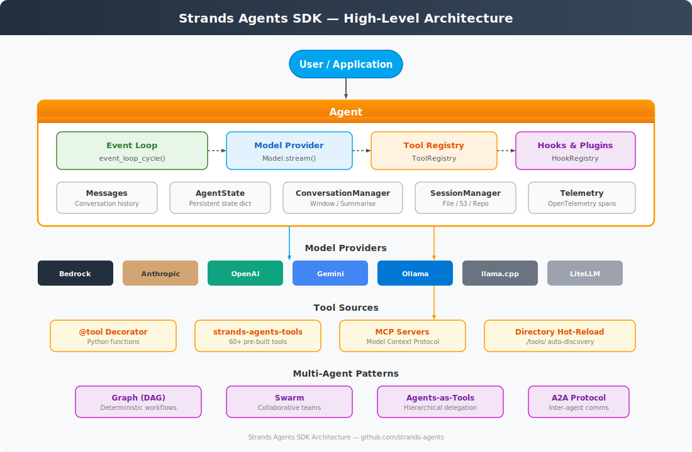

# Strands Agents SDK — Architecture Overview

- **Source**: [github.com/strands-agents](https://github.com/strands-agents)
- **Reference Implementation**: Python SDK (`strands-agents/sdk-python`)
- **Licence**: Apache 2.0

## What Is Strands Agents?

Strands Agents is an open-source, model-driven SDK for building AI agents. Rather than encoding decision trees, the developer defines tools and a system prompt; the LLM itself drives the execution loop, deciding which tools to call and when to stop.

A minimal agent is three lines:

```python
from strands import Agent
from strands_tools import calculator
agent = Agent(tools=[calculator])
agent("What is the square root of 1764?")
```

## Design Principles

| Principle | Description |
|-----------|-------------|
| **Model-driven** | The LLM decides the control flow — no explicit state machines |
| **Model-agnostic** | Pluggable provider abstraction over 13+ backends |
| **Thin core** | The SDK is a ~500-line event loop + provider/tool abstractions |
| **Tool-first** | Everything an agent can do is expressed as a tool |
| **MCP-native** | First-class Model Context Protocol support for external tool servers |
| **Observable** | Built-in OpenTelemetry tracing, metrics, and hook system |
| **Composable** | Multi-agent patterns (Graph, Swarm, A2A) built on the same primitives |

## High-Level Architecture



The SDK consists of seven subsystems:

1. **Agent** — The top-level orchestrator. Holds messages, model, tools, hooks, and state.
2. **Event Loop** — The core cycle: send messages to model → receive response → if tool_use, execute tools → loop.
3. **Model Providers** — Abstract `Model` interface with concrete implementations for each LLM backend.
4. **Tool System** — Registry, decorator, loaders, executors, and MCP client for tool management.
5. **Hooks & Plugins** — Event-driven extension points for every lifecycle stage.
6. **Session & State** — Conversation persistence and agent state management.
7. **Multi-Agent** — Graph, Swarm, and A2A orchestration patterns.

## Repository Map

| Repository | Purpose |
|------------|---------|
| `sdk-python` | Core Python SDK (Agent, Event Loop, Models, Tools) |
| `sdk-typescript` | TypeScript port of the core SDK |
| `tools` | 60+ pre-built tools (file I/O, shell, browser, Slack, AWS, etc.) |
| `agent-sop` | Structured Operating Procedures — markdown workflow templates |
| `samples` | Example agents and use cases |
| `docs` | Official documentation (strandsagents.com) |
| `evals` | Evaluation framework for testing and benchmarking agents |
| `mcp-server` | MCP documentation server for AI coding assistants |
| `agent-builder` | Interactive terminal demo with streaming |
| `devtools` | Shared CI/CD workflows |

## Package Structure (Python SDK)

```
strands/
├── agent/                    # Agent class, AgentResult, conversation managers
│   ├── agent.py              # Main Agent orchestrator (~800 lines)
│   ├── agent_result.py       # Result dataclass (stop_reason, message, metrics)
│   ├── base.py               # AgentBase ABC
│   ├── state.py              # AgentState container
│   └── conversation_manager/ # Sliding window, summarising, null managers
├── event_loop/               # Core execution engine
│   ├── event_loop.py         # event_loop_cycle(), recurse_event_loop()
│   ├── streaming.py          # stream_messages() — model streaming bridge
│   ├── _retry.py             # ModelRetryStrategy
│   └── _recover_*.py         # Max-tokens recovery
├── models/                   # Model provider implementations
│   ├── model.py              # Abstract Model base class
│   ├── bedrock.py            # Amazon Bedrock (default)
│   ├── anthropic.py          # Anthropic direct
│   ├── openai.py             # OpenAI
│   ├── gemini.py             # Google Gemini
│   ├── ollama.py             # Ollama (local)
│   ├── llamacpp.py           # llama.cpp (local)
│   ├── litellm.py            # LiteLLM meta-router
│   ├── sagemaker.py          # SageMaker endpoints
│   └── ...                   # mistral, writer, llamaapi, openai_responses
├── tools/                    # Tool subsystem
│   ├── tools.py              # AgentTool base, PythonAgentTool, validation
│   ├── decorator.py          # @tool decorator → DecoratedFunctionTool
│   ├── registry.py           # ToolRegistry — central tool storage
│   ├── loader.py             # Directory-based discovery and hot-reload
│   ├── watcher.py            # File watcher for hot-reload
│   ├── tool_provider.py      # ToolProvider ABC
│   ├── _caller.py            # _ToolCaller for agent.tool.X() syntax
│   ├── _validator.py         # Tool use validation
│   ├── executors/            # Sequential and Concurrent executors
│   ├── mcp/                  # MCP client, agent tool adapter, instrumentation
│   └── structured_output/    # Pydantic output enforcement via tool calls
├── multiagent/               # Multi-agent orchestration
│   ├── base.py               # MultiAgentBase, MultiAgentResult, NodeResult
│   ├── graph.py              # GraphBuilder — DAG-based execution
│   ├── swarm.py              # Swarm — collaborative self-organising teams
│   └── a2a/                  # Agent-to-Agent protocol (server + executor)
├── hooks/                    # Hook event system
│   ├── events.py             # All hook event dataclasses
│   └── registry.py           # HookRegistry, HookProvider
├── plugins/                  # Plugin system
│   ├── plugin.py             # Plugin ABC
│   ├── decorator.py          # @plugin decorator
│   └── registry.py           # PluginRegistry
├── session/                  # Session persistence
│   ├── session_manager.py    # SessionManager ABC
│   ├── file_session_manager.py
│   ├── s3_session_manager.py
│   └── repository_session_manager.py
├── handlers/                 # Callback handlers for streaming
├── telemetry/                # OpenTelemetry integration
│   ├── tracer.py             # Span management
│   ├── metrics.py            # Trace tree and metrics collection
│   └── config.py             # Telemetry configuration
├── types/                    # Shared type definitions
│   ├── content.py            # Message, Messages, ContentBlock
│   ├── tools.py              # ToolSpec, ToolUse, ToolResult, AgentTool
│   ├── streaming.py          # StreamEvent, StopReason
│   ├── exceptions.py         # All custom exceptions
│   └── ...                   # events, guardrails, media, etc.
└── experimental/             # Unstable features
    ├── bidi/                 # Bidirectional streaming (voice/audio)
    └── steering/             # LLM-based steering and context providers
```
