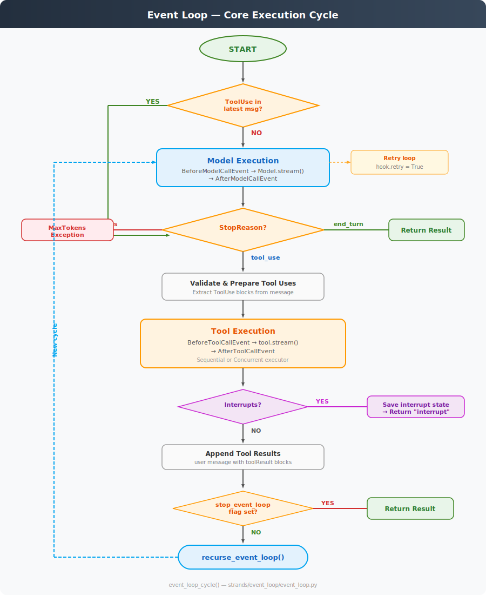

# Event Loop — Core Execution Engine

**Source**: `strands/event_loop/event_loop.py`



## Overview

The event loop is the heart of the Strands Agents SDK. It implements a recursive, model-driven execution cycle where the LLM decides the control flow by choosing when to call tools and when to stop.

The entire loop is **asynchronous** — implemented as `AsyncGenerator[TypedEvent, None]` yielding typed events to callers.

## Entry Points

The call chain from the user-facing API down to the event loop is:

```
Agent.__call__(prompt)
  → Agent.invoke_async(prompt)
    → Agent.stream_async(prompt)
      → Agent._run_loop(messages)
        → Agent._execute_event_loop_cycle(invocation_state)
          → event_loop_cycle(agent, invocation_state)
```

## `event_loop_cycle()` — The Core Function

A single cycle processes one "conversation turn":

### Step 1: Initialisation
- Generate a unique `event_loop_cycle_id` (UUID4)
- Initialise `request_state` if not present
- Start metrics collection and OpenTelemetry tracing span
- Yield `StartEvent()` and `StartEventLoopEvent()`

### Step 2: Check for Existing Tool Uses
Before calling the model, the loop checks three conditions:

| Condition | Action |
|-----------|--------|
| `agent._interrupt_state.activated` | Resume from interrupt — skip model, set `stop_reason = "tool_use"` |
| `_has_tool_use_in_latest_message(messages)` | Tool results already pending — skip model |
| Neither | Proceed to model execution |

### Step 3: Model Execution (`_handle_model_execution`)
- Invoke `BeforeModelCallEvent` hook
- Call `stream_messages(model, system_prompt, messages, tool_specs)`
- The model provider streams response chunks as `StreamEvent`s
- Invoke `AfterModelCallEvent` hook
- **Retry loop**: If `after_event.retry == True` (set by hooks, e.g. `ModelRetryStrategy` for throttling), discard the response and re-invoke the model
- On success: append the response message to `agent.messages`, update usage/metrics

### Step 4: Process Stop Reason

| `stop_reason` | Behaviour |
|---------------|-----------|
| `"end_turn"` | Model is done — yield `EventLoopStopEvent` and return |
| `"max_tokens"` | Raise `MaxTokensReachedException` |
| `"tool_use"` | Proceed to tool execution (Step 5) |

### Step 5: Tool Execution (`_handle_tool_execution`)
1. **Validate**: Extract `ToolUse` blocks from the message, validate structure
2. **Resume interrupts**: If resuming from interrupt, merge existing `tool_results` and filter already-completed tool uses
3. **Execute**: Call `agent.tool_executor._execute()` (Sequential or Concurrent)
4. **Check interrupts**: If any `ToolInterruptEvent` was yielded, save interrupt state and return `"interrupt"` stop reason
5. **Structured output**: If enabled, check if the structured output tool was invoked and extract the result
6. **Append results**: Build a `user` message containing `toolResult` blocks and append to `agent.messages`
7. **Check stop flag**: If `request_state["stop_event_loop"]` is set, return
8. **Recurse**: Otherwise, call `recurse_event_loop()` to start a new cycle

### Step 6: Structured Output Forcing
If `structured_output_model` is enabled and the model returned `"end_turn"` without invoking the output tool:
- Append a user message prompting for structured output
- Set `forced_mode` on the structured output context
- Recurse to get the model to produce the structured output
- If it fails again, raise `StructuredOutputException`

## Recursion Model

The event loop is **recursive, not iterative**. After tool execution, `recurse_event_loop()` creates a child `Trace` and calls `event_loop_cycle()` again. This creates a trace tree:

```
event_loop_cycle (cycle 1)
  ├── stream_messages (model call)
  ├── Tool: calculator
  └── Recursive call
      └── event_loop_cycle (cycle 2)
          ├── stream_messages (model call)
          └── EventLoopStopEvent (end_turn)
```

## Error Handling

| Exception | Handling |
|-----------|----------|
| `ModelThrottledException` | Caught by `AfterModelCallEvent` → `ModelRetryStrategy` sets `retry = True` |
| `ContextWindowOverflowException` | Bubbled up to `Agent._execute_event_loop_cycle()` which calls `conversation_manager.reduce_context()` and retries |
| `MaxTokensReachedException` | Bubbled up directly |
| `EventLoopException` | Wraps any other exception with the current `request_state` |
| Any other `Exception` | Yields `ForceStopEvent`, then wraps in `EventLoopException` |

## Retry Strategy

The `ModelRetryStrategy` (default implementation) uses exponential backoff:
- `MAX_ATTEMPTS = 6`
- `INITIAL_DELAY = 4` seconds
- `MAX_DELAY = 240` seconds (4 minutes)

It registers as a hook on `AfterModelCallEvent` and sets `event.retry = True` to trigger re-invocation.

## Key Types

```
StopReason = "end_turn" | "tool_use" | "max_tokens" | "interrupt"

StreamEvent = dict with "stop" key containing:
  (stop_reason, message, usage, metrics)

TypedEvent = Union[
  StartEvent, StartEventLoopEvent, ModelMessageEvent,
  ToolStreamEvent, ToolResultEvent, ToolInterruptEvent,
  ToolCancelEvent, ForceStopEvent, StructuredOutputEvent,
  EventLoopStopEvent, ModelStopReason
]
```
