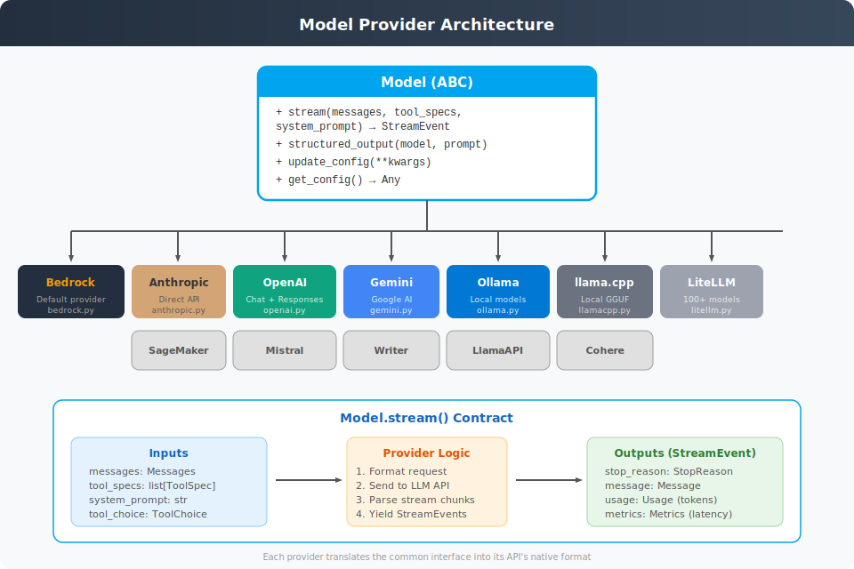

# Model Provider Architecture

**Source**: `strands/models/`



## Overview

The model provider layer is a clean abstraction that isolates the agent loop from LLM-specific API details. Every provider implements the same `Model` ABC, so swapping backends is a one-line configuration change.

## Abstract Interface: `Model`

```python
class Model(ABC):
    def update_config(self, **model_config: Any) -> None: ...
    def get_config(self) -> Any: ...

    def stream(
        self,
        messages: Messages,
        tool_specs: list[ToolSpec] | None = None,
        system_prompt: str | None = None,
        *,
        tool_choice: ToolChoice | None = None,
        system_prompt_content: list[SystemContentBlock] | None = None,
        invocation_state: dict[str, Any] | None = None,
    ) -> AsyncIterable[StreamEvent]: ...

    def structured_output(
        self,
        output_model: type[T],
        prompt: Messages,
        system_prompt: str | None = None,
    ) -> AsyncGenerator[dict[str, T | Any], None]: ...
```

### `stream()` — The Core Method

Each provider must implement `stream()` which:

1. **Formats** the request — converts the common `Messages`, `ToolSpec`, and `SystemContentBlock` types into the provider's native API format
2. **Sends** the request to the LLM API (streaming)
3. **Yields** normalised `StreamEvent` chunks back to the event loop

The last event yielded contains a `"stop"` key with:
- `stop_reason: StopReason` — why the model stopped (`end_turn`, `tool_use`, `max_tokens`)
- `message: Message` — the full assistant message with text and/or tool use blocks
- `usage: Usage` — token counts (input, output, cache read/write)
- `metrics: Metrics` — latency in milliseconds

### `structured_output()` — Typed Responses

Processes prompts and returns Pydantic model instances. Implementations typically:
1. Add the output schema to the prompt
2. Call the model
3. Parse the response into the Pydantic model
4. Raise `ValidationException` if parsing fails

## Supported Providers

| Provider | File | Default Model | Notes |
|----------|------|---------------|-------|
| **Amazon Bedrock** | `bedrock.py` | `us.anthropic.claude-sonnet-4-20250514` | SDK default, uses boto3 |
| **Anthropic** | `anthropic.py` | — | Direct Anthropic API |
| **OpenAI** | `openai.py` | — | Chat completions |
| **OpenAI Responses** | `openai_responses.py` | — | Responses API variant |
| **Google Gemini** | `gemini.py` | — | Google AI Studio |
| **Ollama** | `ollama.py` | — | Local models via Ollama |
| **llama.cpp** | `llamacpp.py` | — | Direct GGUF inference |
| **LlamaAPI** | `llamaapi.py` | — | Hosted Llama models |
| **Mistral** | `mistral.py` | — | Mistral AI API |
| **Writer** | `writer.py` | — | Writer API |
| **SageMaker** | `sagemaker.py` | — | Custom SageMaker endpoints |
| **LiteLLM** | `litellm.py` | — | Meta-router for 100+ providers |
| **Cohere** | (community) | — | Via community contributions |

## Provider Implementation Pattern

Every concrete provider follows the same structure:

```
1. __init__(client_args, model_id, params)
   → Create API client with credentials
   → Store model configuration

2. stream(messages, tool_specs, system_prompt)
   → format_request(messages, tool_specs, system_prompt)
     → Convert Messages to provider's message format
     → Convert ToolSpec to provider's function/tool format
     → Build the API request body
   → send_request(request)
     → Call provider's streaming API
   → process_stream(response)
     → Parse each chunk into StreamEvent
     → Build up the full Message from chunks
     → Yield final stop event with (stop_reason, message, usage, metrics)
```

## Key Types

```python
# Common message format
Message = TypedDict("Message", {"role": str, "content": list[ContentBlock]})
Messages = list[Message]

# Tool specification sent to models
ToolSpec = TypedDict("ToolSpec", {
    "name": str,
    "description": str,
    "inputSchema": dict  # JSON Schema
})

# Token usage
Usage = TypedDict("Usage", {
    "inputTokens": int,
    "outputTokens": int,
    "totalTokens": int,
    "cacheReadInputTokens": NotRequired[int],
    "cacheWriteInputTokens": NotRequired[int],
})

# Tool choice control
ToolChoice = TypedDict with "auto", "any", or "tool" key
```

## Prompt Caching

The `CacheConfig` dataclass enables prompt caching:
- `strategy: "auto"` — automatically inject `cachePoint` markers at optimal positions
- Supported via `system_prompt_content: list[SystemContentBlock]` parameter

## Error Handling

- `ModelThrottledException` — raised when the provider returns a rate-limit error; caught by the event loop's retry strategy
- Provider-specific errors are wrapped or re-raised as appropriate
