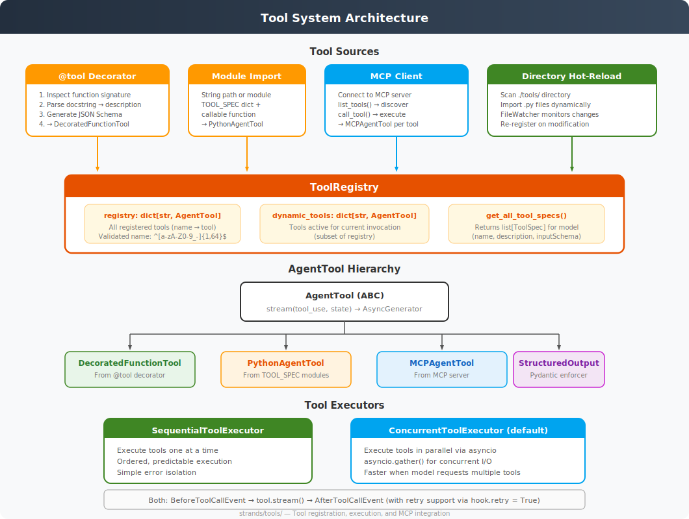

# Tool System Architecture

**Source**: `strands/tools/`



## Overview

The tool system is the mechanism by which agents interact with the world. Every capability — from reading files to calling APIs to delegating to sub-agents — is modelled as a tool. The system handles tool registration, validation, execution, and MCP integration.

## Tool Lifecycle

```
Define → Register → Discover → Validate → Execute → Result
```

## Defining Tools

### 1. `@tool` Decorator (Primary Method)

The decorator transforms a Python function into an `AgentTool`:

```python
@tool
def word_count(text: str) -> int:
    """Count words in text. The LLM sees this docstring."""
    return len(text.split())
```

**Behind the scenes** (`decorator.py`):

1. **`FunctionToolMetadata`** inspects the function:
   - `inspect.signature()` for parameter names, types, defaults
   - `get_type_hints()` for type annotations
   - `docstring_parser` for description and per-parameter docs

2. **Pydantic model generation**: Creates a dynamic `BaseModel` from the function signature for input validation. Special parameters (`self`, `cls`, `agent`) are excluded.

3. **JSON Schema generation**: The Pydantic model produces a JSON Schema which becomes the tool's `inputSchema`. The schema is cleaned:
   - Remove `title`, `additionalProperties` metadata
   - Simplify `anyOf` for Optional types
   - Recursively clean nested structures

4. **`DecoratedFunctionTool`** wraps the function:
   - `__call__()` — preserves normal Python function behaviour
   - `stream()` — validates inputs via Pydantic, executes the function, wraps result in `ToolResult`
   - `__get__()` — descriptor protocol for class methods

**Parameterised decoration**:
```python
@tool(name="custom_name", description="Override docstring", context=True)
def my_tool(ctx: ToolContext, x: int) -> str: ...
```

When `context=True`, a `ToolContext` object is injected containing the tool invocation metadata.

### 2. Module-Level `TOOL_SPEC` (Legacy)

Tools can be defined as Python modules with:
- `TOOL_SPEC: dict` — the tool specification (name, description, inputSchema)
- A callable function that accepts `(tool_use_id, input, **kwargs)`

These become `PythonAgentTool` instances.

### 3. MCP Client (External Tools)

The `MCPClient` connects to any Model Context Protocol server:

```python
mcp_client = MCPClient(lambda: stdio_client(StdioServerParameters(
    command="uvx", args=["some-mcp-server"]
)))
agent = Agent(tools=[mcp_client])
```

**Architecture** (`mcp/mcp_client.py`):
- Runs the MCP connection in a **background thread** with its own event loop
- `start()` → initialise session, `list_tools()` to discover available tools
- Each MCP tool becomes an `MCPAgentTool` in the registry
- `call_tool()` proxies tool execution over the MCP protocol
- Supports prompts, resources, and resource templates
- Implements `ToolProvider` interface for seamless integration

### 4. Directory Hot-Reload

Agents can auto-discover tools from the `./tools/` directory:
- `loader.py` — scans directory, imports `.py` files, registers tools
- `watcher.py` — `FileWatcher` monitors for changes and re-registers on modification
- Enabled via `load_tools_from_directory=True` (default)

## Tool Registry

**`ToolRegistry`** is the central storage for all tools (`registry.py`):

### Registration Flow (`process_tools`)
The registry accepts diverse input types:
- String paths (`"./path/to/tool.py"`, `"strands_tools.calculator"`)
- Module references
- `AgentTool` instances
- Dictionaries with `name` and `path` keys
- Nested lists/tuples of any of the above
- `ToolProvider` instances (loaded asynchronously)

### Storage
- `registry: dict[str, AgentTool]` — all registered tools
- `dynamic_tools: dict[str, AgentTool]` — tools active for current invocation

### Validation
- Tool names must match `^[a-zA-Z0-9_-]{1,64}$`
- Duplicate names rejected (unless hot-reload mode)
- Normalised naming prevents `my-tool` vs `my_tool` conflicts
- Required fields: `name`, `description`, `inputSchema`

### Output
- `get_all_tool_specs() → list[ToolSpec]` — returns specs for the model

## Tool Execution

### Executor Interface (`executors/_executor.py`)

The abstract `ToolExecutor` provides:

```python
class ToolExecutor(ABC):
    @abstractmethod
    def _execute(agent, tool_uses, tool_results, ...) -> AsyncGenerator[TypedEvent]: ...
```

The `_stream()` static method handles single-tool execution with:
- Tool lookup from registry
- `BeforeToolCallEvent` hook (can cancel, interrupt, or modify)
- Tool execution via `selected_tool.stream()`
- `AfterToolCallEvent` hook (can modify result or retry)
- Retry loop: if `after_event.retry == True`, discard result and re-execute

### Sequential Executor (`executors/sequential.py`)
Executes tools one at a time, in order. Simple and predictable.

### Concurrent Executor (`executors/concurrent.py`) — **Default**
Executes all tool uses in parallel via `asyncio.gather()`. Faster when the model requests multiple tools simultaneously.

## Structured Output

The structured output system (`structured_output/`) enforces Pydantic model schemas:

1. A hidden tool is registered whose input schema matches the Pydantic model
2. The model is instructed to call this tool with the output
3. If the model ignores the tool on `end_turn`, the system forces a retry with `tool_choice` set
4. The tool result is parsed into the Pydantic model

## AgentTool Hierarchy

```
AgentTool (ABC)
  ├── tool_name: str
  ├── tool_spec: ToolSpec
  └── stream(tool_use, state) → AsyncGenerator

  ├── DecoratedFunctionTool  (@tool decorator)
  ├── PythonAgentTool        (TOOL_SPEC modules)
  ├── MCPAgentTool           (MCP server tools)
  └── StructuredOutputTool   (Pydantic enforcement)
```

## `_ToolCaller` — Direct Tool Invocation

The `agent.tool` property returns a `_ToolCaller` that enables method-style access:

```python
result = agent.tool.calculator(expression="2 + 2")
```

This bypasses the LLM and calls the tool directly, optionally recording it in conversation history (`record_direct_tool_call=True`).
