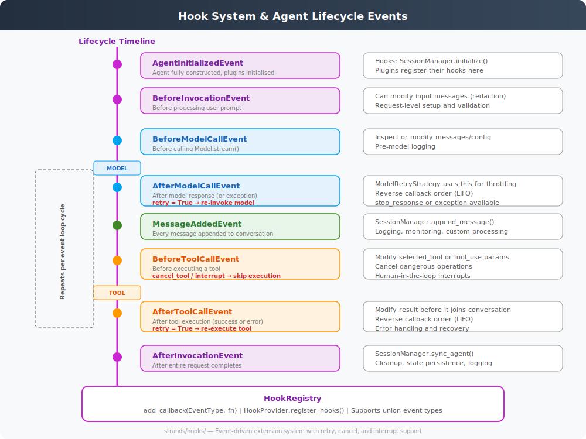

# Hooks, Plugins, and Lifecycle Events

**Source**: `strands/hooks/`, `strands/plugins/`



## Overview

The hook system is the primary extension mechanism for the SDK. Every significant lifecycle event fires a typed hook event, and any number of callbacks can be registered to react, modify state, or control flow (retry, cancel, interrupt).

## Hook Registry

**`HookRegistry`** (`hooks/registry.py`) manages callback registration and invocation:

```python
registry = HookRegistry()
registry.add_callback(BeforeToolCallEvent, my_callback)
```

### Key Features
- **Type-safe**: Callbacks are registered against specific event types
- **Union types**: A callback can register for multiple event types at once
- **Async invocation**: `invoke_callbacks_async(event)` calls all registered callbacks
- **Ordering**: Most events use FIFO order; cleanup events (`After*`) use LIFO (reverse)

### HookProvider Interface

Components that need to register hooks implement `HookProvider`:

```python
class HookProvider(ABC):
    def register_hooks(self, registry: HookRegistry, **kwargs) -> None: ...
```

Built-in hook providers:
- `SessionManager` — persists messages and state
- `ModelRetryStrategy` — handles throttling retries
- `ConversationManager` — manages context window
- Plugins

## Lifecycle Events

### Agent Lifecycle

| Event | When | Writable Fields | Reversible |
|-------|------|-----------------|------------|
| `AgentInitializedEvent` | After agent construction | — | No |
| `BeforeInvocationEvent` | Before processing user prompt | `messages` | No |
| `AfterInvocationEvent` | After request completes | — | Yes (LIFO) |

### Model Lifecycle (per cycle)

| Event | When | Writable Fields | Reversible |
|-------|------|-----------------|------------|
| `BeforeModelCallEvent` | Before `Model.stream()` | — | No |
| `AfterModelCallEvent` | After model response | `retry` | Yes (LIFO) |

**Retry mechanism**: Setting `after_event.retry = True` discards the current response and re-invokes the model. The `ModelRetryStrategy` uses this for exponential backoff on throttling.

### Tool Lifecycle (per tool call)

| Event | When | Writable Fields | Reversible |
|-------|------|-----------------|------------|
| `BeforeToolCallEvent` | Before tool execution | `cancel_tool`, `selected_tool`, `tool_use` | No |
| `AfterToolCallEvent` | After tool execution | `result`, `retry` | Yes (LIFO) |

**Cancel**: Setting `cancel_tool = True` (or a message string) skips execution and returns an error result.

**Interrupt**: Calling `event.interrupt(name)` on `BeforeToolCallEvent` pauses the agent, saving state for later resumption. This enables human-in-the-loop workflows.

**Retry**: Setting `after_event.retry = True` discards the result and re-executes the tool.

### Message Events

| Event | When | Writable Fields |
|-------|------|-----------------|
| `MessageAddedEvent` | Every message appended | — |

Fired for: user messages, assistant responses, and tool result messages.

### Multi-Agent Events

| Event | When |
|-------|------|
| `MultiAgentInitializedEvent` | After orchestrator initialisation |
| `BeforeMultiAgentInvocationEvent` | Before orchestrator execution |
| `AfterMultiAgentInvocationEvent` | After orchestrator completes |
| `BeforeNodeCallEvent` | Before individual node execution |
| `AfterNodeCallEvent` | After individual node completes |

`BeforeNodeCallEvent` also supports `cancel_node` and `interrupt()`.

## Event Properties

All events inherit from `HookEvent` / `BaseHookEvent`:

```python
@dataclass
class HookEvent:
    agent: Agent  # The agent that fired the event
```

Events use `_can_write(name)` to control which fields callbacks can modify, preventing accidental corruption.

## Plugin System

Plugins are higher-level extensions that bundle hook registrations (`plugins/`):

```python
class Plugin(ABC):
    def register_hooks(self, registry: HookRegistry) -> None: ...
```

The `@plugin` decorator can also be used. Plugins are initialised after the agent is fully constructed, during `AgentInitializedEvent` processing.

## Built-in Hook Consumers

| Consumer | Hooks Used | Purpose |
|----------|-----------|---------|
| `SessionManager` | `AgentInitialized`, `MessageAdded`, `AfterInvocation` | Persist conversations |
| `ModelRetryStrategy` | `AfterModelCall` | Exponential backoff on throttle |
| `SlidingWindowConversationManager` | (Called by agent on overflow) | Context window management |
| `StructuredOutputContext` | (Internal, via event loop) | Force structured output tool |

## Interrupt Flow

Interrupts enable human-in-the-loop patterns:

1. Hook on `BeforeToolCallEvent` calls `event.interrupt("confirm_action")`
2. Event loop stores `_interrupt_state` with the tool use message and partial results
3. Agent returns with `stop_reason = "interrupt"` and `AgentResult.interrupts` populated
4. Application presents interrupt to user, collects response
5. On next `agent(prompt)` call, the interrupt state is restored and tool execution resumes
