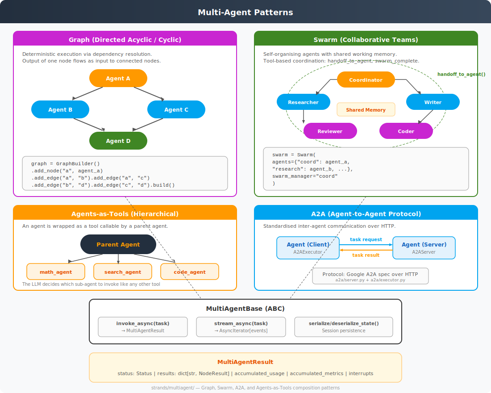

# Multi-Agent Patterns

**Source**: `strands/multiagent/`



## Overview

The multi-agent module provides four composition patterns for orchestrating multiple agents. All patterns build on a shared `MultiAgentBase` abstract class and produce `MultiAgentResult` outputs.

## Base Classes

### `MultiAgentBase`

```python
class MultiAgentBase(ABC):
    id: str

    async def invoke_async(self, task, invocation_state=None) -> MultiAgentResult: ...
    async def stream_async(self, task, invocation_state=None) -> AsyncIterator[dict]: ...
    def __call__(self, task, invocation_state=None) -> MultiAgentResult: ...  # sync wrapper

    def serialize_state(self) -> dict: ...
    def deserialize_state(self, payload: dict) -> None: ...
```

### `MultiAgentResult`

```python
@dataclass
class MultiAgentResult:
    status: Status              # PENDING | EXECUTING | COMPLETED | FAILED | INTERRUPTED
    results: dict[str, NodeResult]  # node_id → result
    accumulated_usage: Usage    # Total tokens across all agents
    accumulated_metrics: Metrics
    execution_count: int
    execution_time: int
    interrupts: list[Interrupt]
```

### `NodeResult`

```python
@dataclass
class NodeResult:
    result: AgentResult | MultiAgentResult | Exception  # Supports nesting
    execution_time: int
    status: Status
    accumulated_usage: Usage
    accumulated_metrics: Metrics
    execution_count: int
    interrupts: list[Interrupt]
```

## Pattern 1: Graph (DAG-Based Execution)

**Source**: `multiagent/graph.py`

Deterministic execution of agents based on dependency edges. Agents are nodes in a directed graph; output from one node flows as input to connected nodes.

### Key Features
- **Dependency resolution**: Nodes execute when all predecessors complete
- **Parallel execution**: Independent nodes run concurrently via `asyncio.gather()`
- **Output propagation**: Each node's output is formatted and passed along edges
- **Cyclic graph support**: Feedback loops with configurable iteration limits
- **Nestable**: A `Graph` can be a node in another `Graph`
- **Conditional edges**: Edge functions can filter/transform data flowing between nodes

### API

```python
graph = GraphBuilder()
graph.add_node("research", research_agent)
graph.add_node("summarise", summary_agent)
graph.add_node("review", review_agent)
graph.add_edge("research", "summarise")
graph.add_edge("summarise", "review")

result = graph.build()("Analyse quantum computing trends")
```

### Node Types
- `Agent` — a standard Strands agent
- `MultiAgentBase` — a nested Graph, Swarm, or any multi-agent orchestrator
- Each node wraps its agent and manages invocation state independently

### Execution Flow
1. Identify root nodes (no predecessors)
2. Execute root nodes in parallel
3. For each completed node, check which successors have all predecessors done
4. Execute ready successors
5. Repeat until all nodes complete or a node fails

### Hooks
The graph fires multi-agent hooks at each stage:
- `MultiAgentInitializedEvent` on build
- `BeforeNodeCallEvent` / `AfterNodeCallEvent` per node
- `BeforeMultiAgentInvocationEvent` / `AfterMultiAgentInvocationEvent` for the whole graph

## Pattern 2: Swarm (Collaborative Teams)

**Source**: `multiagent/swarm.py`

Self-organising agent teams with shared working memory and tool-based coordination.

### Key Features
- **Shared working memory**: All agents read/write to a common context
- **Tool-based handoffs**: Agents use `handoff_to_agent(agent_name, task)` to delegate work
- **`swarm_complete()`**: Special tool that signals the swarm task is done
- **No central controller**: Agents decide when to hand off based on LLM reasoning
- **Configurable manager**: One agent acts as the initial coordinator

### API

```python
swarm = Swarm(
    agents={
        "coordinator": coordinator_agent,
        "researcher": research_agent,
        "writer": writer_agent,
        "reviewer": review_agent,
    },
    swarm_manager="coordinator",
)

result = swarm("Write a technical report on AI safety")
```

### Execution Flow
1. The swarm manager agent receives the initial task
2. The manager (or any active agent) calls `handoff_to_agent("researcher", "Find papers on...")`
3. The researcher agent executes with the shared context
4. The researcher may hand off to `writer`, which may hand off to `reviewer`
5. Any agent can call `swarm_complete(result)` to end the swarm
6. All agents share a working memory that accumulates context

### Injected Tools
The swarm automatically injects coordination tools into each agent:
- `handoff_to_agent(agent_name: str, task: str)` — delegate to another agent
- `swarm_complete(result: str)` — signal task completion

## Pattern 3: Agents-as-Tools (Hierarchical)

This is not a separate class but a usage pattern. An agent is wrapped as a tool:

```python
@tool
def research_agent_tool(query: str) -> str:
    """Delegate research queries to the research specialist."""
    result = research_agent(query)
    return str(result)

parent = Agent(tools=[research_agent_tool, write_tool, review_tool])
parent("Write a report on AI safety with thorough research")
```

The parent agent's LLM decides when to invoke the sub-agent, just like any other tool. This creates a natural hierarchy.

## Pattern 4: A2A (Agent-to-Agent Protocol)

**Source**: `multiagent/a2a/`

Standardised inter-agent communication over HTTP, following the Google A2A specification.

### Components

| Component | File | Role |
|-----------|------|------|
| `A2AServer` | `a2a/server.py` | Exposes an agent as an A2A-compatible HTTP server |
| `A2AExecutor` | `a2a/executor.py` | Client that sends tasks to remote A2A agents |
| `_converters` | `a2a/_converters.py` | Converts between Strands and A2A message formats |

### Usage

**Server side**:
```python
server = A2AServer(agent=my_agent, host="0.0.0.0", port=8080)
server.start()
```

**Client side**:
```python
executor = A2AExecutor(url="http://agent-host:8080")
result = executor("Analyse this dataset")
```

This enables distributed agent systems where agents run as separate services and communicate via a standard protocol.

## Session Persistence

All multi-agent patterns support state serialisation:
- `serialize_state()` → JSON-serialisable dict
- `deserialize_state(payload)` → restore from dict
- `SessionManager` hooks fire on `MultiAgentInitializedEvent`, `AfterNodeCallEvent`, and `AfterMultiAgentInvocationEvent`

## Comparison

| Feature | Graph | Swarm | Agents-as-Tools | A2A |
|---------|-------|-------|-----------------|-----|
| Execution model | Deterministic DAG | Self-organising | LLM-decided | Request/response |
| Parallelism | Yes (independent nodes) | No (sequential handoffs) | No (tool calls) | Yes (separate services) |
| Shared state | Via edge outputs | Shared working memory | Via parent context | Via protocol |
| Nesting | Yes | Yes (Graph in Swarm) | Natural | Via composition |
| Best for | Pipelines, workflows | Creative collaboration | Simple delegation | Distributed systems |
