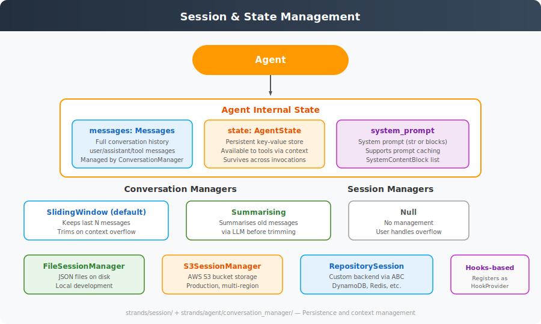

# Session & State Management

**Source**: `strands/session/`, `strands/agent/state.py`, `strands/agent/conversation_manager/`



## Overview

The SDK manages three kinds of state:
1. **Conversation history** (`messages`) — the full message list
2. **Agent state** (`state`) — a persistent key-value store
3. **Session persistence** — serialising the above to external storage

## Agent Internal State

### Messages (`agent.messages: Messages`)
The conversation history is a list of `Message` dicts:

```python
Message = {"role": str, "content": list[ContentBlock]}
```

Roles: `"user"`, `"assistant"`

Content blocks can be:
- `{"text": str}` — plain text
- `{"toolUse": ToolUse}` — model requesting a tool call
- `{"toolResult": ToolResult}` — tool execution result
- `{"image": ...}` — image content
- And other provider-specific types

Messages are appended by the event loop and tool executors. The `MessageAddedEvent` hook fires for each addition.

### AgentState (`agent.state: AgentState`)
A persistent dictionary-like container available to tools via `ToolContext`:

```python
agent = Agent(state={"counter": 0})

@tool(context=True)
def increment(ctx: ToolContext):
    ctx.agent.state["counter"] += 1
```

The state survives across invocations (multiple `agent(prompt)` calls) and is persisted by the session manager.

### System Prompt
Dual representation:
- `agent.system_prompt: str | None` — backward-compatible string
- `agent._system_prompt_content: list[SystemContentBlock]` — advanced, supports prompt caching

## Conversation Managers

Conversation managers handle context window overflow by trimming or summarising old messages.

### `SlidingWindowConversationManager` (Default)

Configured with a `window_size` (number of messages to keep). When the context window overflows:

1. `ContextWindowOverflowException` is caught by `_execute_event_loop_cycle()`
2. `reduce_context()` is called
3. The manager trims the oldest messages, keeping the most recent `window_size` messages
4. The event loop retries

### `SummarizingConversationManager`

Before trimming, it:
1. Takes the messages that would be trimmed
2. Sends them to the LLM for summarisation
3. Replaces them with a single summary message
4. Then applies sliding window

This preserves more context at the cost of an extra LLM call.

### `NullConversationManager`

No management — the user is responsible for handling overflow. Useful when the application manages context externally.

## Session Managers

Session managers persist the agent's state across process restarts. They register as `HookProvider`s and react to lifecycle events.

### Hook Registration

```python
class SessionManager(HookProvider, ABC):
    def register_hooks(self, registry):
        registry.add_callback(AgentInitializedEvent, self.initialize)
        registry.add_callback(MessageAddedEvent, self.append_message)
        registry.add_callback(MessageAddedEvent, self.sync_agent)
        registry.add_callback(AfterInvocationEvent, self.sync_agent)
        # Multi-agent hooks
        registry.add_callback(MultiAgentInitializedEvent, self.initialize_multi_agent)
        registry.add_callback(AfterNodeCallEvent, self.sync_multi_agent)
        registry.add_callback(AfterMultiAgentInvocationEvent, self.sync_multi_agent)
```

### Abstract Methods

| Method | Purpose |
|--------|---------|
| `initialize(agent)` | Load existing session or create new one |
| `append_message(message, agent)` | Persist a new message |
| `sync_agent(agent)` | Full agent state sync |
| `redact_latest_message(message, agent)` | Replace last message (PII redaction) |

### `FileSessionManager`
- Persists to JSON files on disk
- One file per session
- Best for local development

### `S3SessionManager`
- Persists to AWS S3 bucket
- Supports multi-region deployment
- Suitable for production

### `RepositorySessionManager`
- Backed by abstract `SessionRepository` interface
- Implement for DynamoDB, Redis, PostgreSQL, etc.
- Most flexible option

## Multi-Agent Session Support

Multi-agent orchestrators (Graph, Swarm) have additional session methods:
- `initialize_multi_agent(source)` — restore orchestrator state
- `sync_multi_agent(source)` — persist orchestrator state

These use `serialize_state()` / `deserialize_state()` on the `MultiAgentBase` to capture the full execution state including node results, accumulated metrics, and interrupt state.

## Concurrency

The agent uses a `threading.Lock` (`_invocation_lock`) to prevent concurrent invocations:
- `ConcurrentInvocationMode.THROW` (default) — raises `ConcurrencyException`
- `ConcurrentInvocationMode.UNSAFE_REENTRANT` — allows concurrent access (unsafe, for advanced use)
