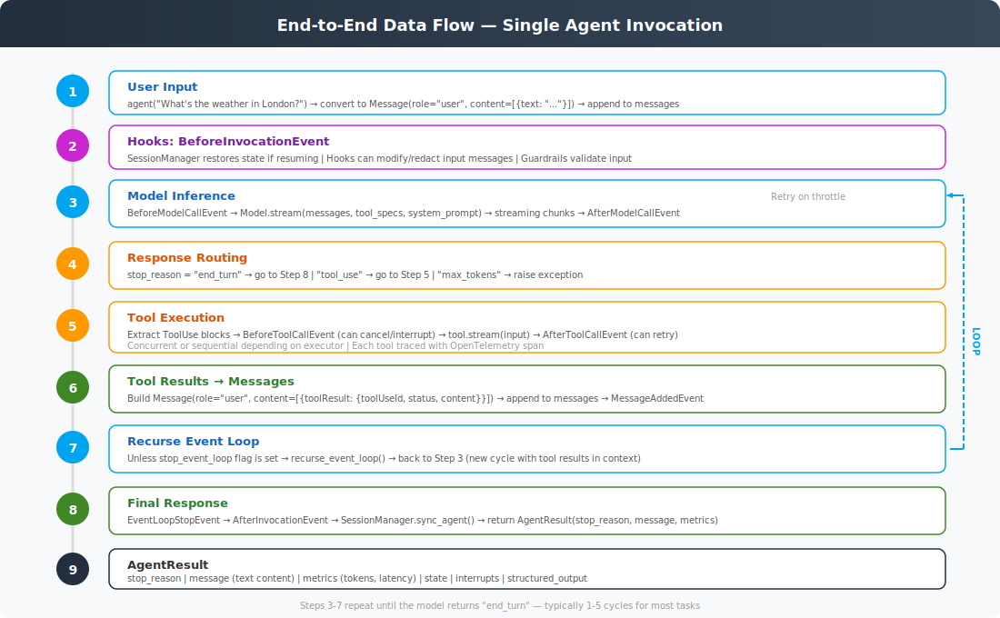

# End-to-End Data Flow



## Complete Flow of a Single Invocation

This traces what happens when you call `agent("What's the weather in London?")`:

### Step 1: User Input
```python
result = agent("What's the weather in London?")
```
- `__call__` → `invoke_async` → `stream_async` → `_run_loop`
- The prompt string is converted to `Message(role="user", content=[{"text": "..."}])`
- Appended to `agent.messages`

### Step 2: BeforeInvocationEvent
- `SessionManager.initialize()` restores previous session if available
- Guardrails or PII redaction hooks can modify `event.messages`
- Any setup/validation logic runs here

### Step 3: Model Inference
- `BeforeModelCallEvent` fires
- `stream_messages()` calls `model.stream(messages, tool_specs, system_prompt)`
- The model sees the full conversation + available tools
- Streaming chunks are yielded back as events
- `AfterModelCallEvent` fires — can trigger retry on throttle

### Step 4: Response Routing
The model's `stop_reason` determines the next step:
- `"end_turn"` → the model has a final answer, skip to Step 8
- `"tool_use"` → the model wants to call tool(s), proceed to Step 5
- `"max_tokens"` → response was truncated, raise `MaxTokensReachedException`

### Step 5: Tool Execution
For each `ToolUse` block in the assistant's message:
1. `BeforeToolCallEvent` fires — hooks can cancel, interrupt, or modify
2. The tool's `stream()` method executes with the provided inputs
3. `AfterToolCallEvent` fires — hooks can modify the result or retry

Multiple tools may execute concurrently (default) or sequentially.

### Step 6: Tool Results → Messages
- Each tool result is wrapped as `{"toolResult": {"toolUseId": "...", "status": "success", "content": [...]}}`
- A single `Message(role="user", content=[...all tool results...])` is built
- Appended to `agent.messages`
- `MessageAddedEvent` fires → session manager persists

### Step 7: Recurse
Unless `request_state["stop_event_loop"]` is set, the event loop recurses:
- `recurse_event_loop()` starts a new cycle
- The model now sees the tool results in the conversation
- Back to Step 3

### Step 8: Final Response
- `EventLoopStopEvent` is yielded with the final message
- `AfterInvocationEvent` fires → session manager syncs final state
- Metrics are finalized

### Step 9: AgentResult Returned
```python
AgentResult(
    stop_reason="end_turn",
    message={"role": "assistant", "content": [{"text": "It's currently 12°C..."}]},
    metrics=EventLoopMetrics(...),
    state={...},
    interrupts=None,
    structured_output=None,
)
```

## Typical Cycle Count

| Scenario | Cycles |
|----------|--------|
| Simple Q&A (no tools) | 1 |
| Single tool call | 2 (model → tool → model) |
| Multi-step reasoning | 3-5 |
| Complex research task | 5-10+ |

## Message History Growth

After a 2-cycle invocation with one tool call:

```
messages = [
  {"role": "user", "content": [{"text": "What's the weather?"}]},           # User input
  {"role": "assistant", "content": [{"toolUse": {"name": "weather", ...}}]}, # Model requests tool
  {"role": "user", "content": [{"toolResult": {"status": "success", ...}}]}, # Tool result
  {"role": "assistant", "content": [{"text": "It's 12°C in London..."}]},    # Final answer
]
```

## Streaming Events

Callers using `stream_async()` receive a stream of typed events throughout execution:

```python
async for event in agent.stream_async("What's the weather?"):
    if "data" in event:           # Text chunk from model
        print(event["data"], end="")
    elif "tool_use" in event:     # Tool being called
        print(f"Calling {event['tool_use']['name']}...")
    elif "tool_result" in event:  # Tool completed
        print(f"Got result")
```

This enables real-time UIs that show the agent's progress as it works.
